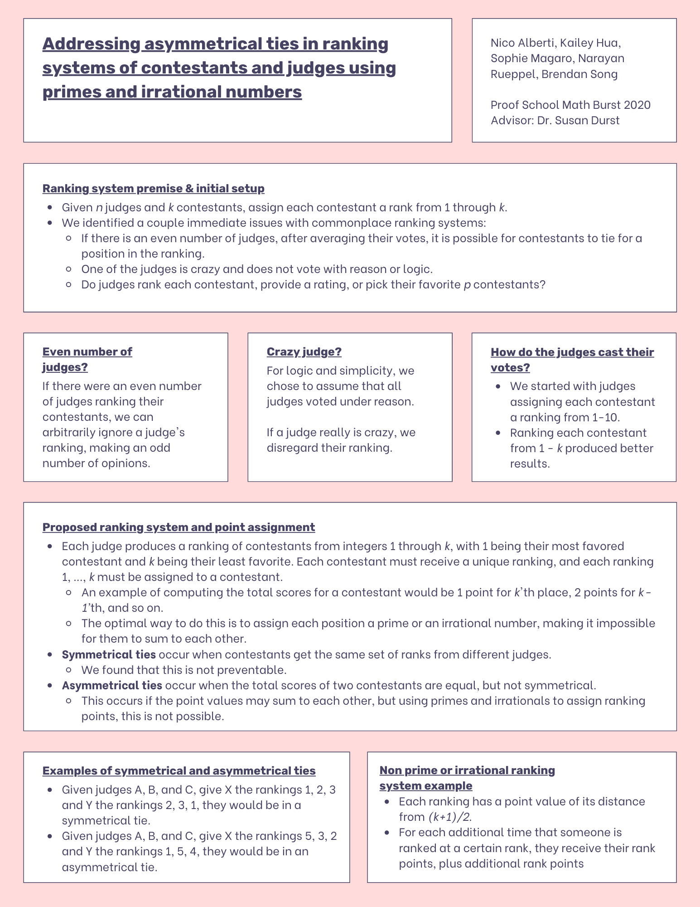
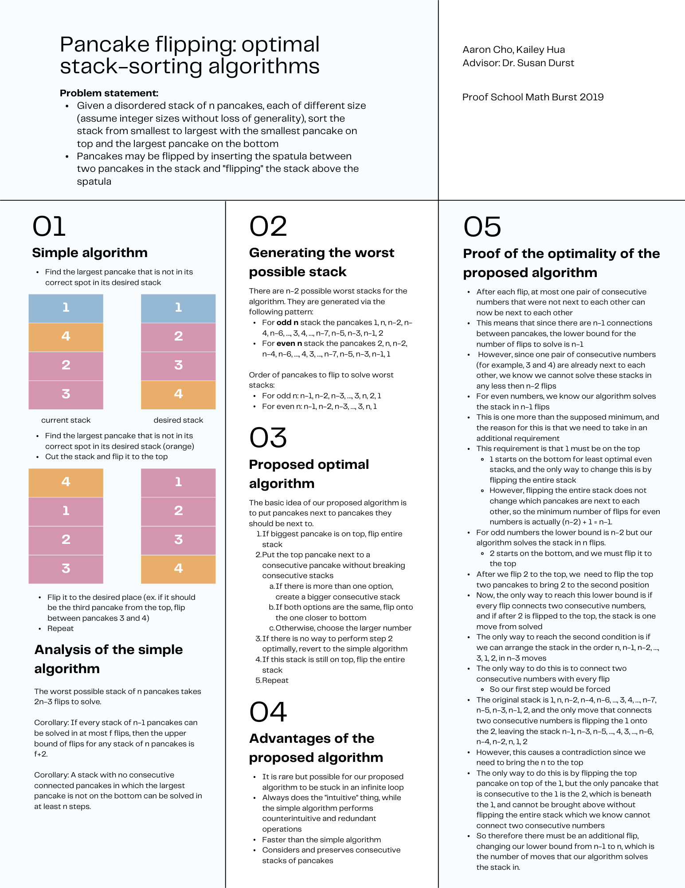

# mathburst
Research from Proof School Math Burst
- 2019: Pancake flipping: optimal stack-sorting algorithms
- 2020: Addressing asymmetrical ties in ranking systems of contestants and judges using primes and irrational numbers
- 2021: Analyzing the growth of n-dimensional crystal cellular automata

