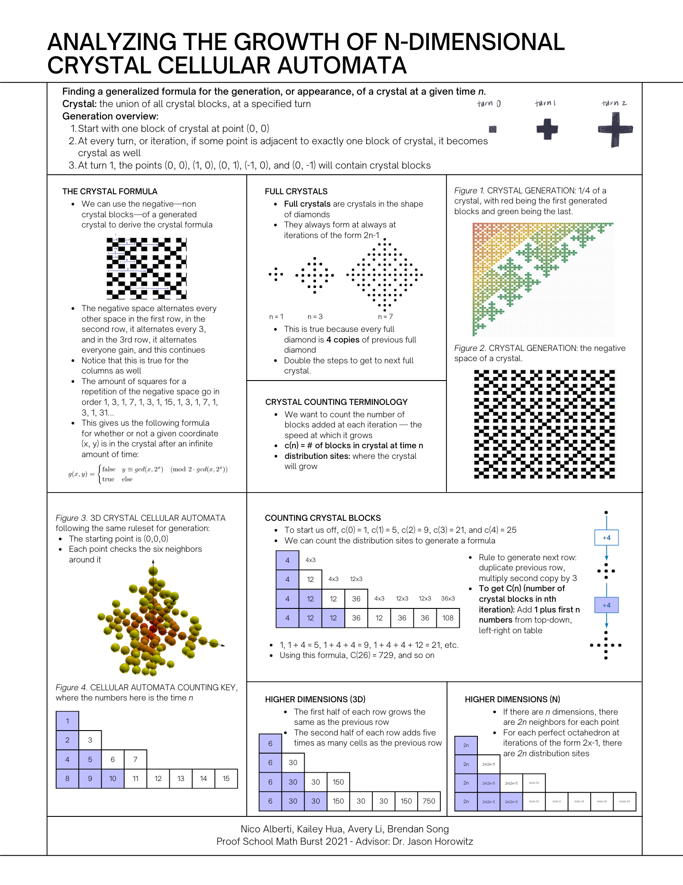

# mathburst
Research from Proof School Math Burst
- 2019: Pancake flipping algorithms (optimal stack sorting)
- 2020: Designing ranking systems with systems of judges
- 2021: Analyzing the growth of n-dimensional crystal cellular automata

